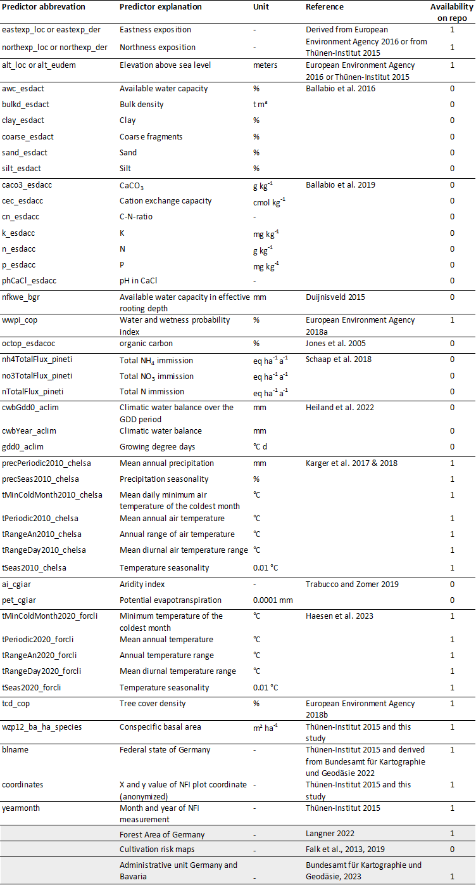

# German Regeneration Maps 2012
We combined regeneration density observations from the German NFI to map the forest regeneration across Germany and evaluate potential regeneration gaps using a three-step approach.
First, we combined the NFI regeneration data with environmental data to construct species-specific regeneration models.
Second, we evaluated the predictive performance of the regeneration models using 10-fold blocked cross-validation and used the validated models to predict regeneration densities for the forest area of Germany. 
Third, we mapped indicators of regeneration quantity and quality, demonstrating their potential application for Bavaria. 

See additional information in references:  
- for full data references and methods please look up our preprint
- for related code see GitHub and Zenodo
- to view and explore the generated regeneration maps online please see Google Earth Engine 

## R-script workflow

 
  
The figure shows the sequence of the script execution as well as the input and output data. Highlighted is the availability status of the datasets on Zenodo. 

## Predictors

 
  
The table displays the predictor variables their abbrevation, explanation, unit, reference and data availability on Zenodo (link below). 
Lines highlighted in gray are other datasets mentioned in the R-script workflow graph above. For full data reference please see preprint (link below).

## References
Preprint on EcoEvoRxiv:  
Data on Zenodo: https://doi.org/10.5281/zenodo.15550864  
Code on Zenodo: https://doi.org/10.5281/zenodo.15552196  
Code on GitHub: https://github.com/LeonieCG/GermanRegenerationMaps2012  
Map display on Google Earth Engine: https://easi.users.earthengine.app/view/regeneration-maps  