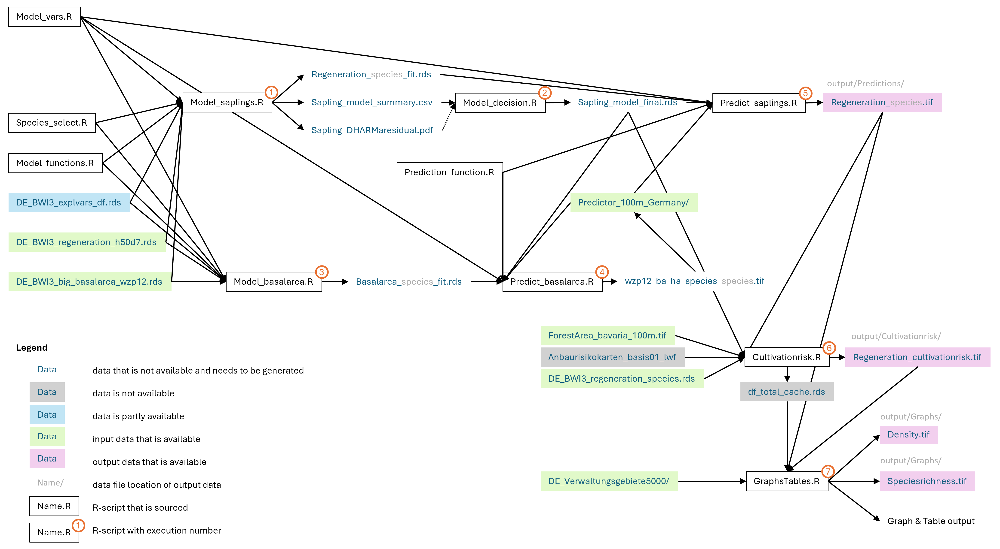

# German Regeneration Maps 2012
We combined regeneration density observations from the German NFI to map the forest regeneration across Germany and evaluate potential regeneration gaps using a three-step approach.
First, we combined the NFI regeneration data with environmental data to construct species-specific regeneration models.
Second, we evaluated the predictive performance of the regeneration models using 10-fold blocked cross-validation and used the validated models to predict regeneration densities for the forest area of Germany. 
Third, we mapped indicators of regeneration quantity and quality, demonstrating their potential application for Bavaria.

## R-script workflow
  
The figure shows the sequence of the script execution as well as the input and output data. Highlighted is the availability status of the data sets on Dryad. 

## Predictors
  
The figure displays the predictor variables their abbrevation, explanation, unit, reference and data availability on Dryad (link below). For Data referene please see preprint (link below).

## References
### Map display
Google Earth Engine: https://easi.users.earthengine.app/view/regeneration-maps

### Data repository
Dryad:

### Code repository
GitHub: https://github.com/LeonieCG/GermanRegenerationMaps2012/tree/d96906c994e455165d89478cdce7481886312871
Zenodo: 